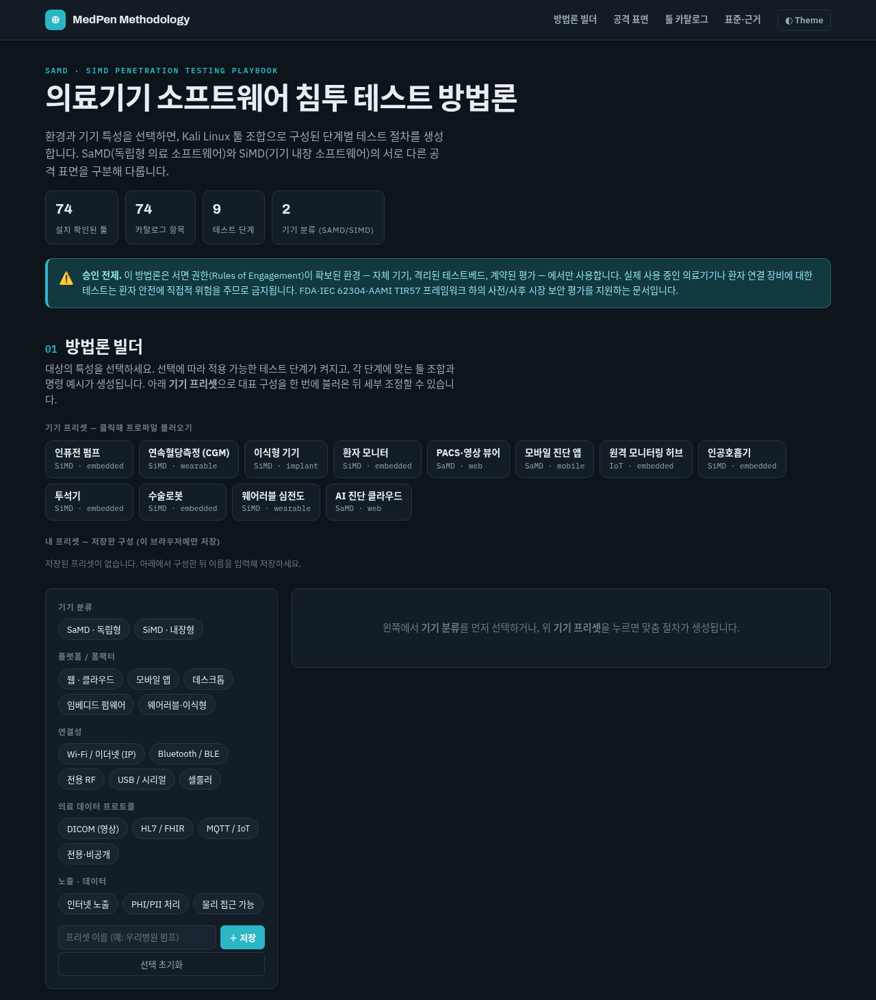
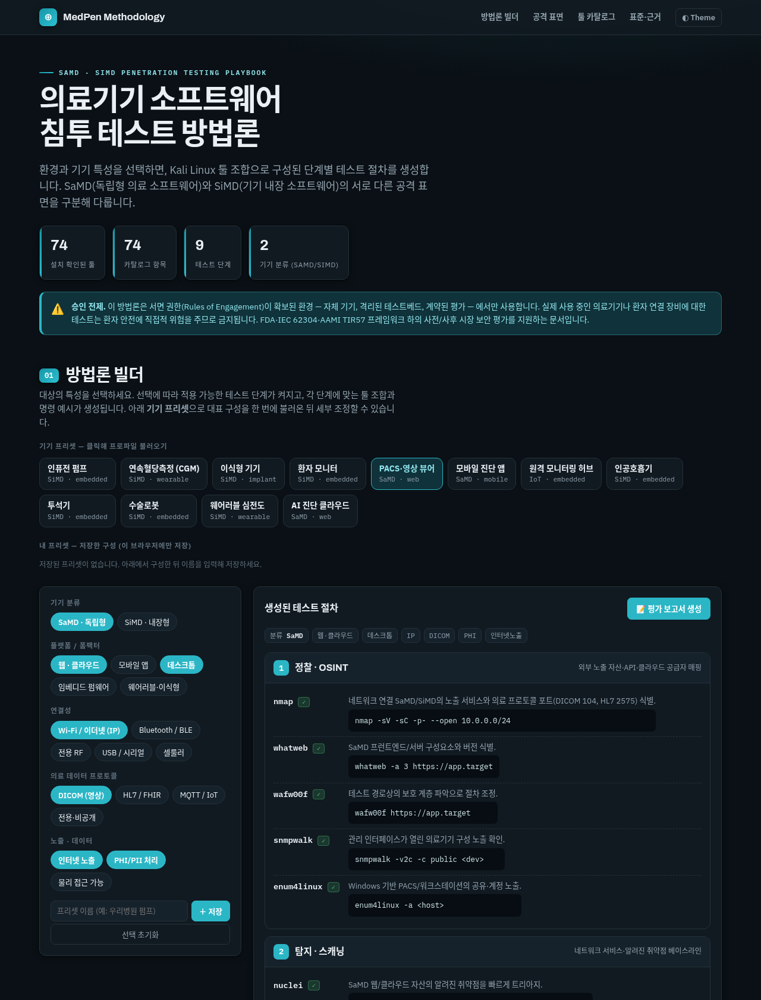
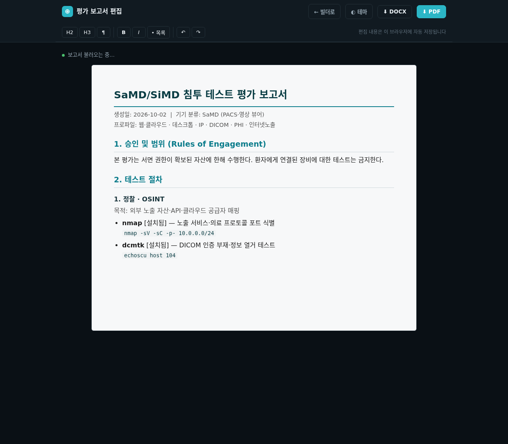
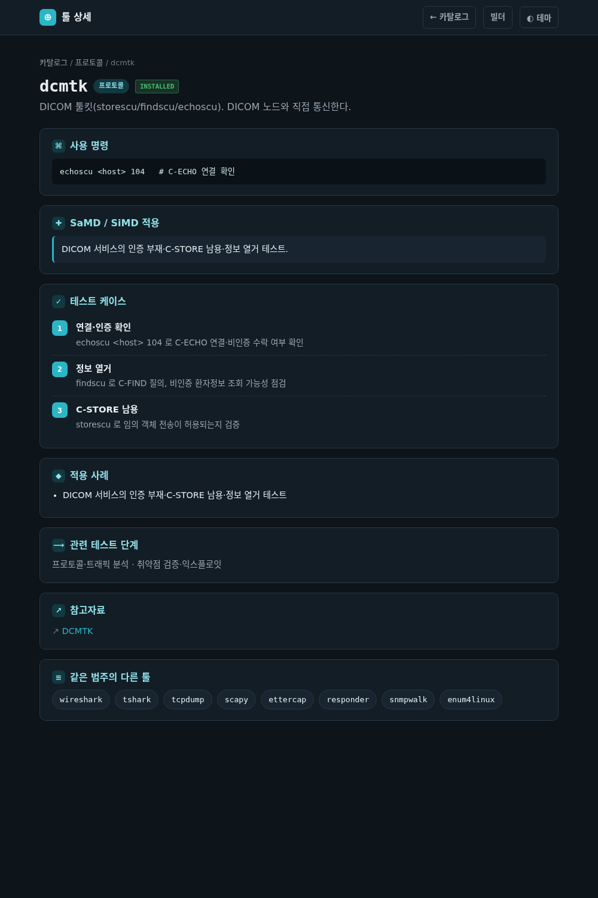
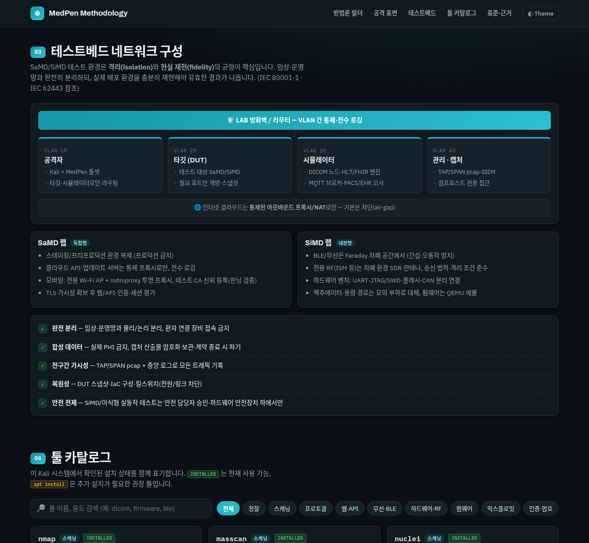

# MedPen — SaMD/SiMD 침투 테스트 방법론

[](https://processware-ai.github.io/MedPen/)
[](https://github.com/Processware-AI/MedPen/deployments)
[](./LICENSE)

의료기기 소프트웨어(SaMD·SiMD)의 보안 평가를 위한 **인터랙티브 방법론 플레이북**과 **Kali Linux 툴 설치 스크립트**입니다. 환경과 기기 특성을 선택하면 최적의 툴 조합으로 구성된 단계별 침투 테스트 절차를 생성합니다.

**🌐 라이브 사이트: https://processware-ai.github.io/MedPen/**

> **⚠️ 승인 전제 (Authorized use only)**
> 본 저장소는 **서면 권한(Rules of Engagement)이 확보된 환경** — 자체 기기, 격리된 테스트베드, 계약된 평가 — 에서의 **방어·보안 평가**를 지원합니다.
> 실제 사용 중이거나 환자에게 연결된 의료기기에 대한 테스트는 **환자 안전에 직접적 위험**을 주므로 금지됩니다. SiMD/이식형 테스트는 반드시 환자와 분리된 전용 벤치에서, 안전 담당자 승인 하에 수행하십시오.

---

## 구성

| 파일 | 설명 |
|---|---|
| [`index.html`](./index.html) | 독립 실행형 방법론 홈페이지 (오프라인 동작, GitHub Pages 배포) |
| [`tool.html`](./tool.html) | 툴 상세 페이지 (설명·테스트 케이스·사례·참고자료) |
| [`report.html`](./report.html) | 평가 보고서 편집 페이지 (편집 → DOCX/PDF 내보내기) |
| [`tools-data.js`](./tools-data.js) | 공유 툴 데이터 (카탈로그 + 상세) — 단일 출처 |
| [`install-medpen-tools.sh`](./install-medpen-tools.sh) | SaMD/SiMD 평가 툴 자동 설치 스크립트 (멱등성) |

---

## 스크린샷

**개요** — 기기 분류·테스트 단계·툴 카탈로그 한눈에



**방법론 빌더** — 프리셋(PACS·영상 뷰어) 적용 시 단계별 절차·툴 조합·명령 예시 자동 생성. “평가 보고서 생성”으로 편집 페이지로 전달



**평가 보고서 편집** — 생성된 보고서를 직접 편집한 뒤 DOCX/PDF로 내보내기



**툴 상세 페이지** — 툴 클릭 시 개요·테스트 케이스·적용 사례·참고자료 확인



**테스트베드 네트워크 구성** — 격리 LAB 토폴로지·SaMD/SiMD 랩 분기·안전 체크리스트



---

## 사용법

### 빠른 시작
1. **(선택) 평가 툴 설치** — Kali에서 `./install-medpen-tools.sh` 실행 (카탈로그의 모든 툴 사용 시)
2. **사이트 열기** — [라이브 사이트](https://processware-ai.github.io/MedPen/) 접속 또는 로컬에서 `xdg-open index.html`
3. **대상 설정** — 상단 **기기 프리셋**을 클릭하거나, 왼쪽에서 기기 분류(SaMD/SiMD)·플랫폼·연결성·의료 프로토콜·노출/데이터를 직접 선택
4. **절차 검토** — 오른쪽에 생성된 단계별 테스트 절차·툴 조합·명령 예시·선정 이유 확인
5. **보고서 생성** — **📝 평가 보고서 생성** 클릭 → 편집 페이지(`report.html`)가 새 탭으로 열림
6. **편집** — 서식 툴바(H2/H3/굵게/목록 등)로 내용 다듬기, "5. 발견 요약"에 결과 작성 (자동 저장)
7. **내보내기** — **⬇ DOCX** 또는 **⬇ PDF** 로 평가 보고서 다운로드

> 💡 자주 쓰는 구성은 왼쪽 패널에서 이름을 지정해 **내 프리셋**으로 저장해 두면 한 번에 다시 불러올 수 있습니다.

### 예시 시나리오
| 대상 | 프리셋 | 중심 단계·툴 | 내보내기 |
|---|---|---|---|
| BLE 웨어러블 혈당계 | 연속혈당측정(CGM) | 무선·BLE·펌웨어 — `ubertooth` `crackle` `gatttool` `openocd` `ghidra` | PDF |
| 영상진단 뷰어 | PACS·영상 뷰어 | 프로토콜·웹·암호 — `dcmtk` `wireshark` `burpsuite` `sslyze` | DOCX |
| 모바일 진단 앱 | 모바일 진단 앱 | 웹/API·정적분석 — `mitmproxy` `frida` `apktool` `jadx` | DOCX/PDF |

> ⚠️ 모든 테스트는 서면 권한이 확보된 격리 환경에서만 수행하세요. SiMD/이식형은 환자와 분리된 전용 벤치가 전제입니다.

---

## 1. 방법론 홈페이지 — `index.html`

[라이브 사이트](https://processware-ai.github.io/MedPen/)에서 바로 사용하거나, 로컬에서 브라우저로 열 수 있습니다. 외부 네트워크 없이 동작하며, 폰트만 온라인일 때 로드됩니다.

```bash
xdg-open index.html
```

### 주요 기능
- **방법론 빌더** — 기기 분류(SaMD/SiMD)·플랫폼·연결성·의료 프로토콜·노출/데이터를 선택하면, 적용 가능한 테스트 단계와 각 단계별 툴 조합·명령 예시·선정 이유를 생성
- **기기 프리셋 (12종)** — 인퓨전 펌프, 연속혈당측정(CGM), 이식형 기기, 환자 모니터, PACS·영상 뷰어, 모바일 진단 앱, 원격 모니터링 허브, 인공호흡기, 투석기, 수술로봇, 웨어러블 심전도, AI 진단 클라우드
- **내 프리셋** — 현재 구성을 저장/삭제 (브라우저 `localStorage`, 이 기기 한정)
- **평가 보고서 생성 → 편집 → 내보내기** — “평가 보고서 생성”을 누르면 별도 편집 페이지([`report.html`](./report.html))가 열립니다. 생성된 보고서(승인·범위, 단계별 절차, 표준 매핑, 안전 주의, 발견 요약)를 직접 편집한 뒤 **DOCX**(Word) 또는 **PDF**로 내려받습니다. DOCX는 편집 HTML을 OOXML로 변환(라이브러리 불필요), PDF는 브라우저 인쇄 엔진을 사용해 한글이 온전하고 텍스트 선택이 가능. 편집 내용은 브라우저에 자동 저장됩니다
- **툴 카탈로그 + 상세 페이지** — 설치 상태·용도·명령 예시·의료기기 적용 포인트, 검색·카테고리 필터. 각 툴을 클릭하면 상세 페이지([`tool.html`](./tool.html))에서 개요·**테스트 케이스**·**적용 사례**·참고자료·같은 범주의 다른 툴을 확인 (74개 툴)
- **테스트베드 네트워크 구성** — 격리 LAB 토폴로지(VLAN 세그먼트), SaMD/SiMD 랩 분기, 안전·통제 체크리스트. 빌더는 선택한 프로파일에 맞춰 **권장 랩 구성**(세그먼트·시뮬레이터·차폐·하드웨어 벤치 등)을 절차와 함께 출력하고, 평가 보고서에도 포함 (IEC 80001-1 · IEC 62443 참조)
- 다크/라이트 테마, 모바일 반응형

### SaMD vs SiMD
| 관점 | SaMD (독립형) | SiMD (내장형) |
|---|---|---|
| 정의 | 하드웨어와 독립적으로 의료 목적 수행 (진단 앱, 분석 클라우드, PACS) | 물리 의료기기의 일부로 동작 (인퓨전 펌프, 모니터, 이식형 펌웨어) |
| 주 공격 표면 | 웹/API, 인증·세션, 클라우드 설정, 모바일 저장소 | 펌웨어, 디버그 포트(UART/JTAG), 무선 프로토콜, 부트체인 |
| 핵심 단계 | 정찰 → 웹/API → 인증·암호 → 프로토콜 | 펌웨어 추출/분석 → 무선·BLE → 프로토콜 퍼징 → 물리 인터페이스 |
| 안전 영향 | 데이터 무결성·가용성 (오진, PHI 유출) | 직접적 환자 위해 (용량 변조, 정지) |

### 테스트 9단계
정찰·OSINT → 탐지·스캐닝 → 프로토콜·트래픽 분석 → 웹·API → 무선·BLE → 펌웨어·임베디드 → 취약점 검증·익스플로잇 → 인증·암호 → 리포팅·추적성

---

## 2. 툴 설치 스크립트 — `install-medpen-tools.sh`

`kali-tools-top10` 기반 경량 설치에서, SaMD/SiMD 평가에 필요한 추가 툴을 설치합니다. 이미 설치된 툴은 건너뛰며(멱등성), 실패 시 안전하게 재실행할 수 있습니다.

```bash
./install-medpen-tools.sh              # 핵심 툴만 (apt + pipx) — 권장
./install-medpen-tools.sh --with-meta  # 의료기기 평가용 메타패키지까지 (수 GB)
./install-medpen-tools.sh --meta-only  # 메타패키지만
./install-medpen-tools.sh --dry-run    # 미리보기 (설치 안 함)
./install-medpen-tools.sh -h           # 전체 옵션
```

| 방식 | 툴 |
|---|---|
| **apt** | `dcmtk`(DICOM), `apktool`, `jadx`, `ghidra`, `can-utils` |
| **pipx** | `frida-tools`, `volatility3`, `objection` |
| **메타패키지** (선택) | `kali-tools-reverse-engineering`, `-hardware`, `-sdr`, `-rfid`, `-bluetooth`, `-wireless` |

> apt 패키지는 `sudo`로, pipx 패키지는 일반 사용자 권한으로 설치됩니다.

---

## 참조 표준
- **FDA** Premarket Cybersecurity Guidance (2023) — SBOM, 위협 모델링, 침투 테스트 증거
- **IEC 62304** — 의료기기 소프트웨어 생명주기 / 안전 등급(A/B/C)
- **AAMI TIR57 · ISO 14971** — 보안 위험과 안전 위험 연계
- **IEC 81001-5-1** — 헬스 소프트웨어 보안 활동 (사후시장 포함)
- **OWASP** ASVS / MASVS / API Top 10
- **MITRE** ATT&CK / Medical Device Rubric

---

## 면책
본 자료는 교육 및 승인된 보안 평가 목적으로만 제공됩니다. 사용자는 적용 가능한 법률과 계약상 권한을 준수할 책임이 있으며, 무단 테스트로 인한 결과에 대해 저자는 책임지지 않습니다.

## 라이선스
[MIT License](./LICENSE) © 2026 Processware-AI
